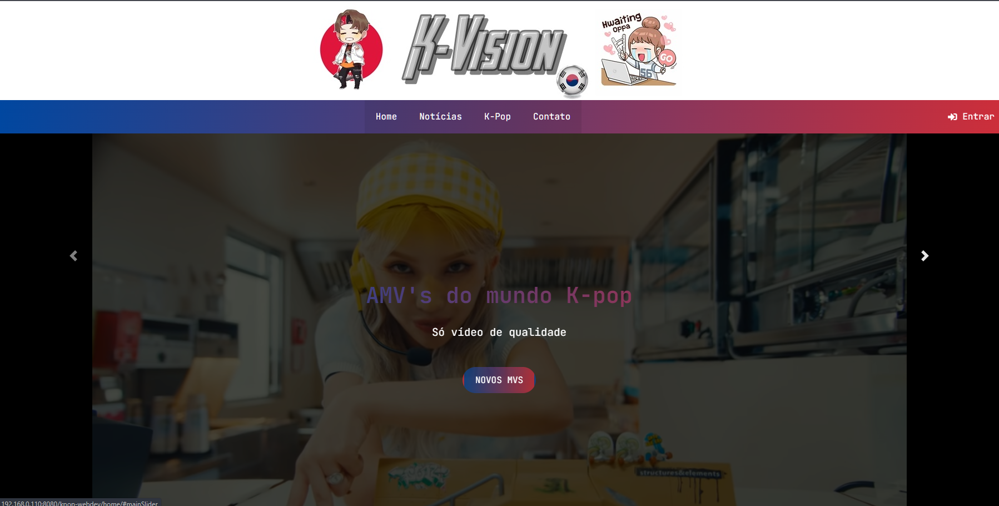
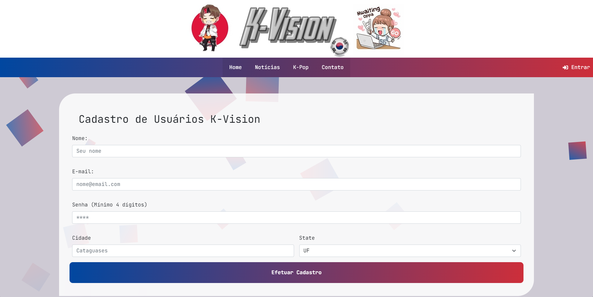
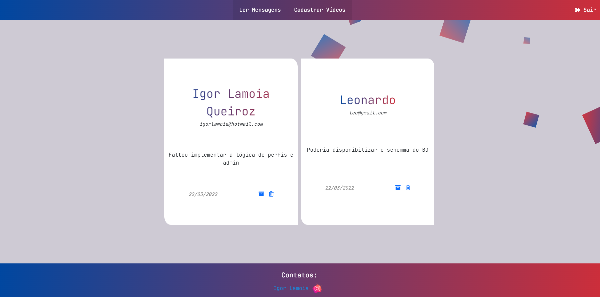
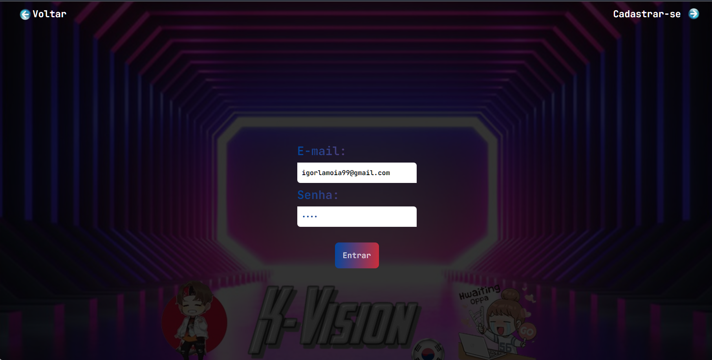
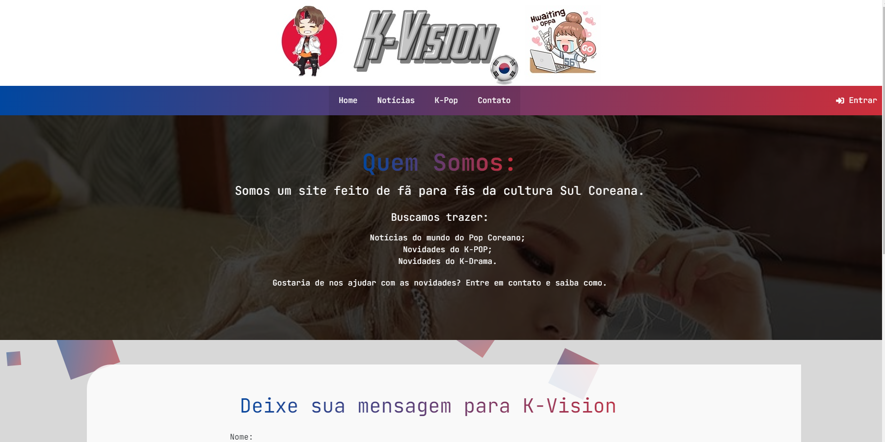

# PROJETO PARA DISCIPLINA DE DESENVOLVIMENTO WEB

O site contemplou o <b>CRUD</b> básico (Create, Read, Update, Delete).

<b>C</b>reate ➕:

- Conta;
- Mensagem;
- Novos vídeos.

<b>R</b>ead 📝:

- Vídeos cadastrados no site (BD);
- Mensagens salvas;
- Contas cadastradas.

<b>U</b>pdate ♻️:

- Marcar mensagem como lida;

<b>D</b>elete ➖:

- Excluir mensagem do site;

# Youtube:

<a href="https://www.youtube.com/watch?v=g05jE5UKbF8" target="_blank">Vídeo demonstração</a>

  <a href="#Tecnologias">Tecnologias</a>&nbsp;&nbsp; | <a href="#Imagens">Imagens</a>

# Tecnologias 💻:

- &nbsp; &nbsp; &nbsp;;
-  para slide e forms;
- &nbsp; para as validações;
- 

# Imagens

Página HOME

Página de cadastro de conta

Mensagens enviadas

Tela de Login

Cadastro de mensagem

